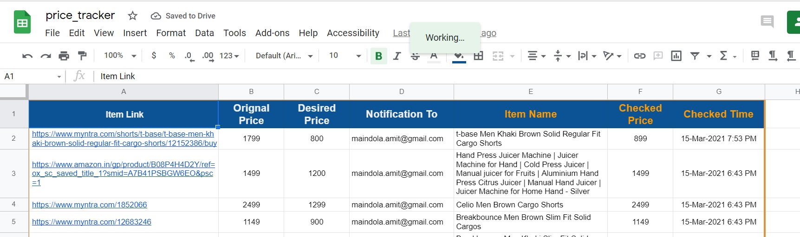

# Price_Tracker
A Price tracker application for popular sites like Amazon and Myntra. 
The Application will refer the list of items to be tracked from a **Google Sheet**, to fetch the latest price and details. 
Sheet will be updated with the latest Price; If price has been dropped for an Item then Email notification will be sent to the user.

## Objective
In the Scrip we will perform below 3 tasks. 
1. Use Google Sheet as a Database and update it with price details. 
2. Use Beautiful Soup (BS4) to perform Web scrapping and fetch the Item details. 
3. Send Email Notification to the User using smtplib module. 

## Installation

1. The application requires the below external Python Libraries, install them using pip.
`pip install -r requirements.txt`
2. Create a Project in your [Google Developer's Console](https://console.developers.google.com/) and download the JSON file to access Google Drive.
3. Also enable the Google sheets API in the project.
4. Generate an App Password from your [Google Account Security](https://myaccount.google.com/security) to send email from your Gmail client.
5. Save the App Password in your environment variable to avoid any hard coding and increased Usability with other projects(if any). 
6. 

## Usage

Create a Google Sheet and make entry in the sheet for the list of items you are wishing to buy at the desired price. <u>***Make entry for the columns (Blue circle) rest of the columns (Red circle) will auto updated by the program.***</u> An email will be triggered if there has been a price drop for any item below or at par the desired price.

1. &#x1F535;**Item Link** : URL of the item to be tracked
2. &#x1F535;**Original Price** : Original price of the item *(Optional)*
3. &#x1F535;**Desired Price** : Triggering price for notification if checked price is at par or below the `Desired Price`
4. &#x1F535;**Notification To** : Email to which notification to be sent if price drops. 
5. &#x1F534;**Item Name** : Full name of the Item. 
6. &#x1F534;**Checked Price** : Current price of the item.
7. &#x1F534;**Checked Time** : Time when the Item was last checked for Price.

## Scheduling

The program can be scheduled in Windows Scheduler or CRON job to run periodically in your local machine. In windows it will be convenient to create a `.bat` file and then schedule the `bat` file instead of giving the whole command with arguments. Similarly for a Linux system create a `.bash` program and then schedule it via CRON Utility. 